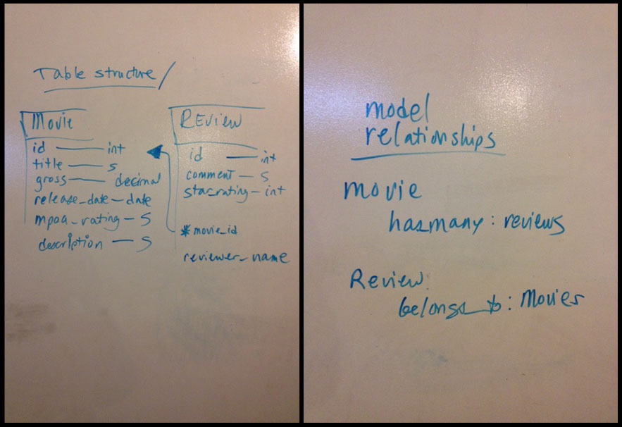
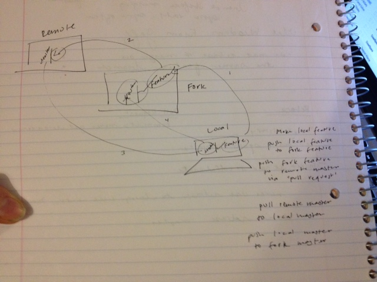

# Bananas App!  Movie API Mini-Project with Nicole, Cara & Gina
- API server deployed to Heroku: https://bananas-movie-reviews.herokuapp.com/movies

## Project Planning
Documentation:

Tracking Workload:

## Pre Planning
Table Structure and Model Relationships:

## Git Workflow
Git Workflow Diagram:

### Git Development Workflow, overview:

#### 1. Feature branch workflow:
##### A. Review all the branch names in the repo you just forked:
    $ git branch ­a

##### B. Create a local feature branch to work on, using a unique name that does not already exist from above:
    $ git branch ­b joe­feature­branch

##### C. While in your local feature branch, do your feature work.

##### D. Continuously add & commit as needed:
    $ git add <file or files>
    $ git commit ­m "commit message"
##### E. Pull from the upstream master to your local master when pull requests from team members are accepted:
    $ git checkout master
    $ git pull upstream master
    $ git checkout feature_branch
    $ git merge master #merge master into feature_branch

#### 2. Complete the feature branch:
##### A. When all work in the branch is complete, push your local feature_branch to your GitHub repo:
    $ git push origin feature_branch

##### B. Go to your github account, select your feature_branch in the drop down and make a pull request from that branch.
­    Pull request reviewed & accepted b/c you rock! Yay!

##### C. Then go back to your local master branch & do a git pull from the upstream repo to get any other changes from others
    $ git checkout master
    $ git pull upstream master

#### 3. Return to Step 1 and start work on a new feature branch.
